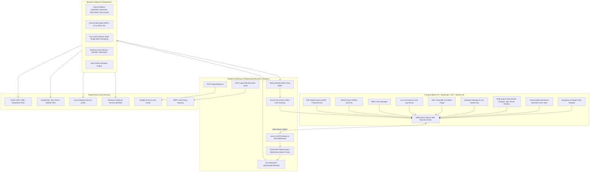

# DataPulse Sentinel - Real-Time DBA Monitoring & Diagnostics Platform

<div align="center">

[](LICENSE)
[](https://react.dev/)
[](https://www.typescriptlang.org/)
[](https://vitejs.dev/)
[](https://tailwindcss.com/)
[](https://expressjs.com/)
[](https://ai.google.dev/)
[](#-security--rbac-matrix)

**Unified Real-Time Database Performance Monitoring, Centralized Distributed Polling, Agentless Host Monitoring, Threshold-Based Incident Response, Cross-Database Audit Logs, RBAC Team Management, and AI-Powered Diagnostics for Oracle, PostgreSQL, SQL Server, and MySQL.**

[Live Demo](http://localhost:3000) • [Architecture](#-architecture) • [Features](#-core-capabilities) • [Quick Start](#-quick-start) • [API Reference](#-api-endpoints)

</div>

---

## 📑 Table of Contents

- [Overview](#-overview)
- [Architecture](#-architecture)
- [Core Capabilities](#-core-capabilities)
  - [1. Real-Time Telemetry & SSE Streaming](#1-real-time-telemetry--sse-streaming)
  - [2. Multi-Engine Deep Diagnostics (Oracle, PostgreSQL, SQL Server, MySQL)](#2-multi-engine-deep-diagnostics)
  - [3. Scalable Centralized Polling Engine](#3-scalable-centralized-polling-engine)
  - [4. Agentless Host & Infrastructure Monitoring (Linux SSH & Windows WinRM)](#4-agentless-host--infrastructure-monitoring)
  - [5. Alert Thresholds & Incident War Room](#5-alert-thresholds--incident-war-room)
  - [6. Connection & Authentication Logs Stream](#6-connection--authentication-logs-stream)
  - [7. Role-Based Access Control (RBAC)](#7-role-based-access-control-rbac)
  - [8. Automated Email Notification System](#8-automated-email-notification-system)
  - [9. Gemini AI Diagnostic Assistant](#9-gemini-ai-diagnostic-assistant)
  - [10. Exportable PDF SLA & Health Reports](#10-exportable-pdf-sla--health-reports)
  - [11. Real-Time Search Palette (`Cmd+K`)](#11-real-time-search-palette-cmdk)
- [Engine-Specific Metrics](#-engine-specific-metrics)
- [Security & RBAC Matrix](#-security--rbac-matrix)
- [API Endpoints](#-api-endpoints)
- [Project Directory Structure](#-project-directory-structure)
- [Quick Start & Installation](#-quick-start)
- [Automated Testing & Verification](#-automated-testing--verification)
- [License](#-license)

---

## 🔍 Overview

**DataPulse Sentinel** is built to solve the operational fragmentation faced by Database Administrators (DBAs), Site Reliability Engineers (SREs), and DevOps teams managing heterogeneous enterprise database fleets and underlying server infrastructures. It unifies performance metrics across **Oracle (CDB/PDB & Standalone)**, **PostgreSQL**, **Microsoft SQL Server**, and **MySQL**, paired with agentless host metrics (Linux SSH & Windows WinRM/WMI), centralized multi-tier polling, live connection logs, incident alerting, team access controls, and compliance reporting into a single high-performance cockpit styled with an **Elegant Dark** theme tailored for 24/7 Network Operations Centers (NOC).

---

## 🏛️ Architecture



---

## ✨ Core Capabilities

### 1. Real-Time Telemetry & SSE Streaming
- **Live Metric Streams**: High-frequency streaming updates for CPU utilization, mean query latency (ms), active connection saturation, disk IOPS, and replication lag.
- **Server-Sent Events (SSE)**: Real-time SSE endpoint (`/api/stream/telemetry`) streaming snapshots, telemetry deltas, circuit breaker state changes, and heartbeat pings directly to React clients.
- **Interactive Recharts**: Dynamic gradient area charts and bar charts tracking latency spikes vs. slow queries (> 2000ms).
- **Layout Presets**:
  - `Primary DBA Command Center`: Full balanced overview across fleet and host performance.
  - `Incident Response & Outage War Room`: Focused on active firing alerts and latency anomalies.
  - `Security, Auth & Connection Audit`: Focused on SSL handshakes, timeouts, and access trails.
- **Customizable Widgets**: Toggle metric gauges, latency charts, connection charts, engine deep-dives, host infrastructure cards, and log streams.

### 2. Multi-Engine Deep Diagnostics
Tailored telemetry panels and automated diagnostics for heterogeneous database engines:
- **Oracle Database (19c / 21c / 23ai)**:
  - **Multitenant (CDB/PDB)**: CDB Root vs Pluggable Database container metrics, open modes (`READ WRITE`, `MOUNTED`), per-PDB CPU slice percentages, active user sessions, and autoextend headroom.
  - **SGA & PGA Dynamic Memory**: Buffer Cache Hit Ratio, Shared Pool allocation, Large Pool, Java Pool, and PGA cache hit percentages.
  - **ASM Diskgroups**: Automatic Storage Management diskgroup allocation, usable free file space, and redundancy modes (`NORMAL`, `HIGH`, `EXTERNAL`).
  - **Redo Logs & Throughput**: Redo log switch frequencies (current rate vs. 24-hour historical buckets), LGWR latency, checkpoint lag, and log group sizing.
  - **Wait Classes & ASH Events**: Non-idle wait classes (`System I/O`, `Concurrency`, `Commit`, `Application`), top wait events (`db file sequential read`, `enq: TX`, `log file sync`), and Data Guard replication transport/apply lag.
  - **Deterministic Rule Heuristics (`ORCL-01` to `ORCL-05`)**: Automated evaluations for buffer hit deficits, redo thrashing, PDB CPU starvation, ASM space exhaustion, and Data Guard lag with tailored `ALTER SYSTEM` / `DBMS_RESOURCE_MANAGER` SQL remediation.
- **PostgreSQL**: Autovacuum background workers, dead tuples, WAL generation rate (MB/s), idle-in-transaction session inspector, and `pg_stat_activity` active transaction table.
- **Microsoft SQL Server**: TempDB latch contention (`PAGELATCH_UP`), Page Life Expectancy (PLE), batch requests/sec, and XML deadlock graph inspector.
- **MySQL**: InnoDB buffer pool hit ratios, dirty page tracking, connected threads vs. max limits, and slow query logs (`log_queries_not_using_indexes`).

### 3. Scalable Centralized Polling Engine
- **Location-Aware Bounded Worker Pools**: Concurrency-bounded worker queues partitioned across network zones/datacenters (`eu-west-1`, `us-east-1`, `ap-southeast-1`) preventing socket starvation and connection spikes.
- **Adaptive 3-Tiered Cadence**:
  - **Tier 1 (Heartbeat - 5–10s)**: High-priority TCP ping, uptime, active session counts, and basic connection validation.
  - **Tier 2 (Telemetry - 15–60s)**: CPU%, Memory%, IOPS, latency, buffer hit ratio, and replication lag.
  - **Tier 3 (Deep Diagnostics - 2–15m)**: Tablespace fragmentation, ASM diskgroups, wait classes, and deadlock graphs.
- **Circuit Breakers & Exponential Backoff**: Automatic 3-state circuit breakers (`CLOSED` $\rightarrow$ `OPEN` $\rightarrow$ `HALF_OPEN`) with jittered backoff preventing cascading connection failures on unreachable nodes.
- **Sliding Ring Buffer**: In-memory fixed-size circular ring buffer maintaining sliding-window historical metrics with rolling percentile summaries ($P_{95}$, average, min, max).

### 4. Agentless Host & Infrastructure Monitoring
- **Linux Hosts (SSH)**: Agentless metric sampling via single-command consolidated batch execution (`/proc/stat`, `/proc/meminfo`, `df -Pk`, `loadavg`, `diskstats`) over persistent SSH connection pools.
- **Windows Hosts (WinRM / WMI)**: Agentless WMI WQL query engine retrieving `Win32_Processor`, `Win32_OperatingSystem`, and `Win32_LogicalDisk` metrics.
- **Host-to-Database Correlation Engine**: Automatically pairs database instances with their underlying host server metrics to distinguish between query lock contention and OS-level hardware exhaustion (CPU/RAM paging/Disk I/O wait).

### 5. Alert Thresholds & Incident War Room
- **Rule Engine**: Configurable thresholds across `CPU`, `MEMORY`, `LATENCY`, `CONNECTIONS`, `DISK_SPACE`, and `REPLICATION_LAG` with distinct warning and critical levels.
- **War Room Triage**: Real-time firing alert banners with immediate breach delta, acknowledgment workflow with investigator notes, and direct execution of automated remediation scripts.

### 6. Connection & Authentication Logs Stream
- **Live Tail Feed**: Streaming audit trail of client connection handshakes, authentication successes/failures, query timeouts, and SSL handshake errors.
- **Real-Time Indexing & Filters**: Instant search by client IP, username, database name, engine type, and severity level (`INFO`, `WARN`, `ERROR`).
- **Log Inspector**: Expandable rows showing raw SQL payloads, client TLS cipher versions, and duration.

### 7. Role-Based Access Control (RBAC)
- **Granular Security Matrix**: Four role tiers (`SUPER_ADMIN`, `SENIOR_DBA`, `JUNIOR_DBA`, `AUDITOR`).
- **Permission Enforcement**: Guards threshold modifications, remediation script execution, credential management, and user invitations.
- **Dynamic Role Switcher**: Test different permission levels instantly from the top navigation bar.

### 8. Automated Email Notification System
- **HTML Template Builder**: Dynamic HTML email template designer supporting live variable interpolation (`{{database_name}}`, `{{current_value}}`, `{{threshold_value}}`, `{{severity}}`, `{{fired_at}}`, `{{notes}}`).
- **Live Dual-Mode Preview**: Switch between visual rendering and raw HTML source code.
- **Simulated SMTP Dispatcher**: Backend endpoint (`POST /api/notifications/test-email`) for delivery verification.

### 9. Gemini AI Diagnostic Assistant
- **Automated Root-Cause Analysis**: Powered by Google Gen AI SDK (`@google/genai`) using the `gemini-3.6-flash` model, with deterministic offline rule fallbacks.
- **Actionable Optimization**: Evaluates slow queries, missing covering indexes, buffer pool memory sizing, PDB CPU skew, and generates engine-tailored SQL statements (e.g. `CREATE INDEX CONCURRENTLY`, `ALTER SYSTEM SET db_cache_size`, or `DBMS_RESOURCE_MANAGER` directives).

### 10. Exportable PDF SLA & Health Reports
- **A4 Printable Reports**: High-resolution, vector-accurate PDF export engine built with `jsPDF` and `html2canvas`.
- **Customizable Report Parameters**: Custom title, timeframe (`24h`, `7d`, `30d`), executive summary notes, fleet health tables, engine-specific breakdowns, and incident post-mortem log.

### 11. Real-Time Search Palette (`Cmd+K`)
- **Instant Omnisearch**: Universal keyboard shortcut (`⌘K` / `Ctrl+K`) with real-time indexing across database instances, active alerts, connection logs, and team members.

---

## 📊 Engine-Specific Metrics

| Metric Category | Oracle 🔶 | PostgreSQL 🐘 | SQL Server ⚡ | MySQL 🐬 |
| :--- | :--- | :--- | :--- | :--- |
| **Buffer Cache Hit** | SGA Buffer Cache Hit % & V$DB_CACHE_ADVICE | `shared_buffers` ratio | Buffer Cache Hit % | `innodb_buffer_pool` Hit % |
| **Multitenancy & Containers** | CDB Root vs PDB Slices (`v$pdbs`, `v$rsrc_pdb_metric`) | Database / Schema separation | Contained Databases | Schemas / Tenants |
| **Lock / Contention** | `enq: TX`, Row Locks, Blocker Trees (`v$session`) | Idle in Transaction & `pg_locks` | TempDB `PAGELATCH_UP` | Table Locks & Metadata Waits |
| **Throughput / IO** | Redo Log Switches/hr & ASM Diskgroups (`+DATA`) | WAL Archival Lag & Generation (MB/s) | Batch Requests / sec | Threads Running / Connected |
| **Health Metric** | Background Processes (PMON, SMON, DBWR, LGWR) | Autovacuum Workers & Dead Tuples | Page Life Expectancy (PLE) | Dirty Pages & Slow Query Log |
| **Replication / HA** | Data Guard Apply & Transport Lag (`v$dataguard_stats`) | Streaming Replication Lag (bytes/sec) | AlwaysOn Availability Group Lag | Binary Log Replication Lag |
| **Diagnostic View** | Top Non-Idle Wait Classes & ASH Events | `pg_stat_activity` | Deadlock XML Graphs | Slow Query Log Index Checks |

---

## 🔒 Security & RBAC Matrix

| Action / Permission | Super Admin | Senior DBA | Junior DBA | Auditor |
| :--- | :---: | :---: | :---: | :---: |
| **View Performance Metrics & Host Stats** | ✅ | ✅ | ✅ | ✅ |
| **Configure Alert Thresholds** | ✅ | ✅ | ❌ | ❌ |
| **Execute Remediation Scripts** | ✅ | ✅ | ❌ | ❌ |
| **Manage Passwords & Host SSL / SSH** | ✅ | ❌ | ❌ | ❌ |
| **Manage Team RBAC & Roles** | ✅ | ❌ | ❌ | ❌ |
| **Generate & Export PDF Reports** | ✅ | ✅ | ✅ | ✅ |

---

## 🔌 API Endpoints

### 1. Health Check
```http
GET /api/health
```
**Response:**
```json
{
  "status": "ok",
  "timestamp": "2026-08-30T14:45:00.000Z"
}
```

### 2. Central Polling Engine Status
```http
GET /api/polling/status
```
**Response:**
```json
{
  "status": "RUNNING",
  "totalEndpoints": 6,
  "activeEndpoints": 6,
  "totalPollsExecuted": 1420,
  "pollsPerSecond": 12.4,
  "zones": [
    { "zone": "eu-west-1", "activeWorkers": 0, "maxConcurrency": 10 },
    { "zone": "us-east-1", "activeWorkers": 0, "maxConcurrency": 10 }
  ],
  "circuitBreakers": { "closed": 6, "open": 0, "halfOpen": 0 }
}
```

### 3. Oracle Telemetry & Rules Diagnostic
```http
GET /api/oracle/telemetry?scenario=HEALTHY_CDB
```
**Response:**
```json
{
  "success": true,
  "telemetry": {
    "instanceInfo": { "dbName": "ORCLCDB", "isCdb": true, "version": "19.22.0.0.0" },
    "sga": { "bufferCacheHitRatio": 99.4, "totalSgaMb": 32768 },
    "pdbs": [
      { "pdbName": "PDB_FINANCE", "conId": 3, "cpuSlicePct": 44.8, "activeSessions": 185 }
    ]
  },
  "report": {
    "overallHealth": "HEALTHY",
    "findings": [
      { "ruleId": "ORCL-01", "severity": "OK", "metricValue": 99.4 }
    ]
  }
}
```

### 4. Real-time SSE Telemetry Stream
```http
GET /api/stream/telemetry
```
*Emits continuous Server-Sent Events (`snapshot`, `telemetry_delta`, `circuit_state`, `heartbeat`, `incident_fired`).*

### 5. Gemini AI DBA Diagnosis
```http
POST /api/ai/diagnose
Content-Type: application/json

{
  "type": "slow_query",
  "databaseType": "Oracle",
  "query": "SELECT /*+ FULL(e) */ * FROM employees e WHERE department_id = :dept_id;",
  "metrics": {
    "cpu": 92.4,
    "latencyMs": 1850,
    "activeConnections": 180
  }
}
```

### 6. Automated Email Dispatch
```http
POST /api/notifications/test-email
Content-Type: application/json

{
  "recipient": "dba-alerts@company.com",
  "subject": "🚨 CRITICAL INCIDENT ALERT: oracle-cdb-core-eu",
  "incident": { "id": "inc-orcl-101", "severity": "CRITICAL" }
}
```

---

## 📂 Project Directory Structure

```
datapulse-dba/
├── README.md                           # Documentation & Architecture Guide
├── package.json                        # Scripts, Dependencies & Test Runners
├── tsconfig.json                       # TypeScript compiler settings
├── vite.config.ts                      # Vite & TailwindCSS plugin config
├── server.ts                           # Express Server (API Gateway, Polling Engine, SSE Stream)
├── index.html                          # HTML5 Entry Point
├── metadata.json                       # Project Capabilities Metadata
├── .env.example                        # Example Environment Variables
├── src/
│   ├── main.tsx                        # React application bootstrap
│   ├── App.tsx                         # Main view router & layout frame
│   ├── index.css                       # Global Tailwind CSS imports
│   ├── types/
│   │   ├── dba.ts                      # Core DBA & Dashboard TypeScript interfaces
│   │   ├── oracle.ts                   # Oracle CDB/PDB, SGA/PGA, ASM & wait event types
│   │   ├── host.ts                     # Linux SSH & Windows WinRM host telemetry types
│   │   └── polling.ts                  # Centralized polling & circuit breaker types
│   ├── mock/
│   │   └── dbaData.ts                  # Seed data for DBs, hosts, incidents, logs, users
│   ├── context/
│   │   └── DBAContext.tsx              # Central state, SSE real-time listener & action handlers
│   ├── collectors/
│   │   ├── oracle/
│   │   │   ├── oracleCollector.ts      # Oracle telemetry collector (CDB/PDB, SGA, ASM)
│   │   │   └── oracleQueries.ts        # Oracle V$ and CDB_ dictionary view queries
│   │   ├── host/
│   │   │   ├── LinuxHostCollector.ts   # Linux SSH collector
│   │   │   ├── LinuxHostMetricParser.ts # Linux /proc and df metric parser
│   │   │   ├── WindowsHostCollector.ts # Windows WinRM collector
│   │   │   └── WindowsHostMetricParser.ts # Windows WMI metric parser
│   │   └── mock/                       # Deterministic mock drivers for offline execution & CI
│   ├── diagnostics/
│   │   └── rules/
│   │       └── oracleRules.ts          # Rule heuristics ORCL-01 to ORCL-05 & AI prompts
│   ├── server/
│   │   └── polling/
│   │       ├── PollingEngine.ts        # Multi-zone scheduler & telemetry dispatcher
│   │       ├── BoundedWorkerPool.ts    # Concurrency-limited priority worker queue
│   │       ├── EndpointCircuitBreaker.ts # 3-state circuit breaker with backoff
│   │       ├── TelemetryRingBuffer.ts  # Fixed-capacity rolling circular buffer
│   │       └── TieredScheduler.ts      # Multi-tier cadence scheduler (L1/L2/L3)
│   └── components/
│       ├── layout/
│       │   ├── Navbar.tsx              # Top bar, DB selector, live ticker, theme toggle, role switcher
│       │   ├── Sidebar.tsx             # Desktop navigation sidebar
│       │   └── MobileNav.tsx           # Mobile navigation bottom bar
│       ├── dashboard/
│       │   ├── CustomizableDashboard.tsx # Main dashboard with Recharts & layout presets
│       │   ├── MetricCard.tsx          # Stat card with progress gauges & status badges
│       │   └── DatabaseEngineMetrics.tsx # Engine-specific tabs (Oracle, Postgres, SQL Server, MySQL)
│       ├── databases/
│       │   └── DatabaseManager.tsx     # Fleet overview, connection testing & DB registration
│       ├── alerts/
│       │   └── ThresholdAlertsManager.tsx # Incident triage war room & threshold rule creator
│       ├── logs/
│       │   └── ConnectionLogsViewer.tsx # Searchable real-time connection log stream
│       ├── rbac/
│       │   └── TeamRBACManager.tsx     # RBAC user directory & permission matrix
│       ├── notifications/
│       │   └── EmailNotificationManager.tsx # HTML email template builder & test dispatcher
│       ├── reports/
│       │   └── PDFReportGenerator.tsx  # Printable A4 PDF SLA report generator
│       ├── ai/
│       │   └── AIDiagnosticModal.tsx   # Gemini AI query tuning & root-cause modal
│       └── search/
│           └── GlobalSearchPalette.tsx # Cmd+K universal search modal
└── tests/
    ├── unit/                           # Unit tests for collectors, rules, parsers, and polling
    ├── integration/                    # E2E integration and correlation tests
    └── load/                           # 100+ endpoint concurrent polling & stress tests
```

---

## 🚀 Quick Start

### Prerequisites
- [Node.js](https://nodejs.org/) (v18.0 or higher recommended)
- `npm`

### Installation

1. **Clone the repository:**
   ```bash
   git clone https://github.com/sakerkadri/datapulse-dba.git
   cd datapulse-dba
   ```

2. **Install project dependencies:**
   ```bash
   npm install
   ```

3. **Configure Environment Variables:**
   ```bash
   cp .env.example .env
   ```
   Add your Gemini API key for live AI diagnostics (optional, fallback heuristic engine runs automatically if unset):
   ```env
   GEMINI_API_KEY="your_google_gemini_api_key"
   ```

4. **Start the Development Server:**
   ```bash
   npm run dev
   ```
   Open your browser at `http://localhost:3000`.

5. **Build and Run for Production:**
   ```bash
   npm run build
   npm start
   ```

---

## 🧪 Automated Testing & Verification

DataPulse Sentinel includes comprehensive automated test suites covering unit tests, integration scenarios, and high-concurrency load testing:

```bash
# Execute all test suites (unit, integration, load)
npm test

# Run individual test tiers
npm run test:unit           # Unit tests (Oracle, Host parsers, Circuit breakers)
npm run test:integration    # Host-to-DB correlation and E2E integration
npm run test:load           # 100+ endpoint concurrent polling load test

# Run strict TypeScript typechecking
npm run lint
```

---

## 📄 License

This project is licensed under the [Apache-2.0 License](LICENSE).