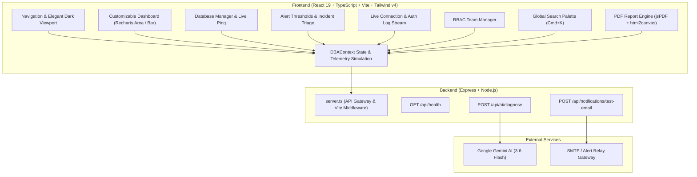

# DataPulse Sentinel - Real-Time DBA Monitoring & Diagnostics Platform

<div align="center">

[](LICENSE)
[](https://react.dev/)
[](https://www.typescriptlang.org/)
[](https://vitejs.dev/)
[](https://tailwindcss.com/)
[](https://expressjs.com/)
[](https://ai.google.dev/)
[](#-security--rbac-matrix)

**Unified Real-Time Database Performance Monitoring, Threshold-Based Incident Response, Cross-Database Audit Logs, RBAC Team Management, and AI-Powered Diagnostics for PostgreSQL, SQL Server, and MySQL.**

[Live Demo](http://localhost:3000) • [Architecture](#-architecture) • [Features](#-core-capabilities) • [Quick Start](#-quick-start) • [API Reference](#-api-endpoints)

</div>

---

## 📑 Table of Contents

- [Overview](#-overview)
- [Architecture](#-architecture)
- [Core Capabilities](#-core-capabilities)
  - [1. Real-Time Telemetry & Monitoring](#1-real-time-telemetry--monitoring)
  - [2. Multi-Engine Deep Diagnostics](#2-multi-engine-deep-diagnostics)
  - [3. Alert Thresholds & Incident War Room](#3-alert-thresholds--incident-war-room)
  - [4. Connection & Authentication Logs Stream](#4-connection--authentication-logs-stream)
  - [5. Role-Based Access Control (RBAC)](#5-role-based-access-control-rbac)
  - [6. Automated Email Notification System](#6-automated-email-notification-system)
  - [7. Gemini AI Diagnostic Assistant](#7-gemini-ai-diagnostic-assistant)
  - [8. Exportable PDF SLA & Health Reports](#8-exportable-pdf-sla--health-reports)
  - [9. Real-Time Search Palette (`Cmd+K`)](#9-real-time-search-palette-cmdk)
- [Engine-Specific Metrics](#-engine-specific-metrics)
- [Security & RBAC Matrix](#-security--rbac-matrix)
- [API Endpoints](#-api-endpoints)
- [Project Directory Structure](#-project-directory-structure)
- [Quick Start & Installation](#-quick-start)
- [License](#-license)

---

## 🔍 Overview

**DataPulse Sentinel** is built to solve the operational fragmentation faced by Database Administrators (DBAs), Site Reliability Engineers (SREs), and DevOps teams managing heterogeneous database fleets. It unifies performance metrics, live connection logs, incident alerting, team access controls, and compliance reporting into a single high-performance cockpit styled with an **Elegant Dark** theme tailored for 24/7 Network Operations Centers (NOC).

---

## 🏛️ Architecture



---

## ✨ Core Capabilities

### 1. Real-Time Telemetry & Monitoring
- **Live Metric Streams**: Second-by-second updates for CPU utilization, mean query latency (ms), active connection pool saturation, disk IOPS, and replication lag.
- **Interactive Recharts**: Dynamic gradient area charts and bar charts tracking latency spikes vs. slow queries (> 2000ms).
- **Layout Presets**:
  - `Primary DBA Command Center`: Full balanced overview.
  - `Incident Response & Outage War Room`: Focused on firing alerts and latency anomalies.
  - `Security, Auth & Connection Audit`: Focused on SSL handshakes, timeouts, and access trails.
- **Customizable Widgets**: Toggle metric gauges, latency charts, connection charts, engine deep-dives, and log streams.

### 2. Multi-Engine Deep Diagnostics
Tailored telemetry panels for individual database engines:
- **PostgreSQL**: Autovacuum background workers, dead tuples, WAL generation rate (MB/s), idle-in-transaction session inspector, and `pg_stat_activity` active transaction table.
- **Microsoft SQL Server**: TempDB latch contention (`PAGELATCH_UP`), Page Life Expectancy (PLE), batch requests/sec, and XML deadlock graph inspector.
- **MySQL**: InnoDB buffer pool hit ratios, dirty page tracking, connected threads vs. max limits, and slow query logs (`log_queries_not_using_indexes`).

### 3. Alert Thresholds & Incident War Room
- **Rule Engine**: Configurable thresholds across `CPU`, `MEMORY`, `LATENCY`, `CONNECTIONS`, `DISK_SPACE`, and `REPLICATION_LAG` with distinct warning and critical levels.
- **War Room Triage**: Real-time firing alert banners with immediate breach delta, acknowledgment workflow with investigator notes, and direct execution of automated remediation scripts.

### 4. Connection & Authentication Logs Stream
- **Live Tail Feed**: Streaming audit trail of client connection handshakes, authentication successes/failures, query timeouts, and SSL handshake errors.
- **Real-Time Indexing & Filters**: Instant search by client IP, username, database name, and severity level (`INFO`, `WARN`, `ERROR`).
- **Log Inspector**: Expandable rows showing raw SQL payloads, client TLS cipher versions, and duration.

### 5. Role-Based Access Control (RBAC)
- **Granular Security Matrix**: Four role tiers (`SUPER_ADMIN`, `SENIOR_DBA`, `JUNIOR_DBA`, `AUDITOR`).
- **Permission Enforcement**: Guards threshold modifications, remediation script execution, credential management, and user invitations.
- **Dynamic Role Switcher**: Test different permission levels instantly from the top navigation bar.

### 6. Automated Email Notification System
- **HTML Template Builder**: Dynamic HTML email template designer supporting live variable interpolation (`{{database_name}}`, `{{current_value}}`, `{{threshold_value}}`, `{{severity}}`, `{{fired_at}}`, `{{notes}}`).
- **Live Dual-Mode Preview**: Switch between visual rendering and raw HTML source code.
- **Simulated SMTP Dispatcher**: Backend endpoint (`POST /api/notifications/test-email`) for delivery verification.

### 7. Gemini AI Diagnostic Assistant
- **Automated Root-Cause Analysis**: Powered by Google Gen AI SDK (`@google/genai`) using the `gemini-3.6-flash` model.
- **Actionable Optimization**: Evaluates slow queries, missing covering indexes, buffer pool memory sizing, and generates engine-tailored `CREATE INDEX CONCURRENTLY` or rewritten SQL statements.

### 8. Exportable PDF SLA & Health Reports
- **A4 Printable Reports**: High-resolution, vector-accurate PDF export engine built with `jsPDF` and `html2canvas`.
- **Customizable Report Parameters**: Custom title, timeframe (`24h`, `7d`, `30d`), executive summary notes, fleet health tables, and incident post-mortem log.

### 9. Real-Time Search Palette (`Cmd+K`)
- **Instant Omnisearch**: Universal keyboard shortcut (`⌘K` / `Ctrl+K`) with real-time indexing across database instances, active alerts, connection logs, and team members.

---

## 📊 Engine-Specific Metrics

| Metric | PostgreSQL 🐘 | SQL Server ⚡ | MySQL 🐬 |
| :--- | :--- | :--- | :--- |
| **Buffer Cache Hit** | `shared_buffers` ratio | Buffer Cache Hit % | `innodb_buffer_pool` Hit % |
| **Lock / Contention** | Idle in Transaction | TempDB `PAGELATCH_UP` | Table Locks & Metadata Waits |
| **Throughput / IO** | WAL Archival Lag | Batch Requests / sec | Threads Running / Connected |
| **Health Metric** | Autovacuum Workers | Page Life Expectancy (PLE) | Dirty Pages & Slow Query Log |
| **Diagnostic View** | `pg_stat_activity` | Deadlock XML Graphs | Slow Query Log Index Checks |

---

## 🔒 Security & RBAC Matrix

| Action / Permission | Super Admin | Senior DBA | Junior DBA | Auditor |
| :--- | :---: | :---: | :---: | :---: |
| **View Performance Metrics** | ✅ | ✅ | ✅ | ✅ |
| **Configure Alert Thresholds** | ✅ | ✅ | ❌ | ❌ |
| **Execute Remediation Scripts** | ✅ | ✅ | ❌ | ❌ |
| **Manage Passwords & SSL** | ✅ | ❌ | ❌ | ❌ |
| **Manage Team RBAC & Roles** | ✅ | ❌ | ❌ | ❌ |
| **Generate & Export PDF Reports** | ✅ | ✅ | ✅ | ✅ |

---

## 🔌 API Endpoints

### 1. Health Check
```http
GET /api/health
```
**Response:**
```json
{
  "status": "ok",
  "timestamp": "2026-08-18T04:45:00.000Z"
}
```

### 2. Gemini AI DBA Diagnosis
```http
POST /api/ai/diagnose
Content-Type: application/json

{
  "type": "slow_query",
  "databaseType": "PostgreSQL",
  "query": "SELECT * FROM analytics_events WHERE created_at > NOW() - INTERVAL '1 hour';",
  "metrics": {
    "cpu": 96.4,
    "latencyMs": 2450,
    "activeConnections": 288
  }
}
```
**Response:**
```json
{
  "analysis": "### Root Cause Analysis\nSequential scan on analytics_events partition table...",
  "timestamp": "2026-08-18T04:45:05.000Z"
}
```

### 3. Automated Email Dispatch
```http
POST /api/notifications/test-email
Content-Type: application/json

{
  "recipient": "dba-alerts@company.com",
  "subject": "🚨 CRITICAL INCIDENT ALERT: pg-analytics-warehouse",
  "incident": { "id": "inc-1001", "severity": "CRITICAL" }
}
```
**Response:**
```json
{
  "success": true,
  "messageId": "msg_1723956300000_abc123",
  "status": "Delivered via DataPulse Automated SMTP Relay"
}
```

---

## 📂 Project Directory Structure

```
datapulse-dba/
├── README.md                           # Documentation & Setup Guide
├── package.json                        # Scripts & Dependencies
├── tsconfig.json                       # TypeScript compiler settings
├── vite.config.ts                      # Vite & TailwindCSS plugin config
├── server.ts                           # Express Server (Vite middleware, Gemini AI, Email API)
├── index.html                          # HTML5 Entry Point
├── metadata.json                       # Project Capabilities Metadata
├── .env.example                        # Example Environment Variables
├── src/
│   ├── main.tsx                        # React application bootstrap
│   ├── App.tsx                         # Main view router & layout frame
│   ├── index.css                       # Global Tailwind CSS imports
│   ├── types/
│   │   └── dba.ts                      # TypeScript interfaces & types
│   ├── mock/
│   │   └── dbaData.ts                  # Seed data for DBs, metrics, incidents, logs, users
│   ├── context/
│   │   └── DBAContext.tsx              # Central state, real-time tick engine & action handlers
│   └── components/
│       ├── layout/
│       │   ├── Navbar.tsx              # Top bar, DB selector, live ticker, theme toggle, role switcher
│       │   ├── Sidebar.tsx             # Desktop navigation sidebar
│       │   └── MobileNav.tsx           # Mobile navigation bottom bar
│       ├── dashboard/
│       │   ├── CustomizableDashboard.tsx # Main dashboard view with Recharts & layout presets
│       │   ├── MetricCard.tsx          # Stat card with progress gauges & status badges
│       │   └── DatabaseEngineMetrics.tsx # Engine-specific tabs (Postgres, SQL Server, MySQL)
│       ├── databases/
│       │   └── DatabaseManager.tsx     # Fleet overview, connection testing & DB registration
│       ├── alerts/
│       │   └── ThresholdAlertsManager.tsx # Incident triage war room & threshold rule creator
│       ├── logs/
│       │   └── ConnectionLogsViewer.tsx # Searchable real-time connection log stream
│       ├── rbac/
│       │   └── TeamRBACManager.tsx     # RBAC user directory & permission matrix
│       ├── notifications/
│       │   └── EmailNotificationManager.tsx # HTML email template builder & test dispatcher
│       ├── reports/
│       │   └── PDFReportGenerator.tsx  # Printable A4 PDF SLA report generator
│       ├── ai/
│       │   └── AIDiagnosticModal.tsx   # Gemini AI query tuning & root-cause modal
│       └── search/
│           └── GlobalSearchPalette.tsx # Cmd+K universal search modal
```

---

## 🚀 Quick Start

### Prerequisites
- [Node.js](https://nodejs.org/) (v18.0 or higher recommended)
- `npm` or `bun`

### Installation

1. **Clone the repository:**
   ```bash
   git clone https://github.com/sakerkadri/datapulse-dba.git
   cd datapulse-dba
   ```

2. **Install project dependencies:**
   ```bash
   npm install
   ```

3. **Configure Environment Variables:**
   ```bash
   cp .env.example .env
   ```
   Add your Gemini API key for live AI diagnostics:
   ```env
   GEMINI_API_KEY="your_google_gemini_api_key"
   ```

4. **Start the Development Server:**
   ```bash
   npm run dev
   ```
   Open your browser at `http://localhost:3000`.

5. **Build and Run for Production:**
   ```bash
   npm run build
   npm start
   ```

---

## 📄 License

This project is licensed under the [Apache-2.0 License](LICENSE).